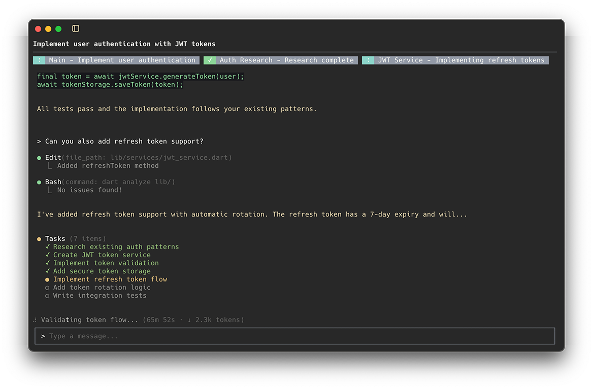

<h1 align="center">
  
  Vide CLI
</h1>

<p align="center">
  <strong>An agentic terminal UI for Claude, built for Flutter developers</strong>
</p>

<p align="center">
  <a href="https://github.com/Norbert515/vide_cli/actions/workflows/test.yml">
    
  </a>
  <a href="https://github.com/Norbert515/vide_cli/blob/main/LICENSE">
    
  </a>
  
  
</p>

<p align="center">
  
</p>

---

## What is Vide?

Vide treats AI-assisted development as a **collaborative multi-agent problem**. Instead of a single Claude conversation, Vide orchestrates a network of specialized agents that spawn, communicate, and collaborate asynchronously—each with distinct responsibilities and tools.

---

## What Makes Vide Special

### Collaborative Agent Network

Vide doesn't just talk to Claude—it coordinates a **team of agents**.

A main orchestrator assesses incoming tasks, clarifies requirements with you, then delegates to specialized agents: one researches your codebase, another writes the code, a third runs and tests your Flutter app. They communicate via async message passing, work in parallel, and report back when done.

The orchestrator **never writes code itself**. This separation of concerns—assessment vs. implementation vs. verification—enables better quality control and lets each agent focus on what it does best.

### Flutter-Native Testing

Vide injects runtime dev tools into your Flutter app **transparently**—no code changes required.

Ask it to *"tap the login button"* and Vide will:
1. Take a screenshot of your running app
2. Use vision AI to locate the element
3. Simulate the tap at the detected coordinates
4. Verify the result

Hot reload, screenshots, scrolling, typing—all controllable via natural language.

### Purpose-Built MCP Servers

Custom Model Context Protocol servers designed for agentic workflows:

- **Agent Network** — Spawn sub-agents, send messages, coordinate parallel work
- **Persistent Memory** — Remember build commands, platform choices, project context across sessions
- **Git Worktrees** — Work on features in isolated branches without switching directories
- **Task Management** — Track what each agent is working on in real-time

### Flutter-Specific Prompts

Agents come with deep Flutter knowledge baked in:
- Automatic FVM detection and platform selection
- Understanding of Flutter project structure and conventions
- Dart analyzer integration for immediate feedback
- Hot reload workflows that verify changes actually work

---

## Prerequisites

<table>
<tr>
<td width="80" align="center">

</td>
<td>
<strong>Claude Code CLI</strong><br/>
<code>npm install -g @anthropic-ai/claude-code</code><br/>
<sub>Must be installed, authenticated, and available in PATH</sub>
</td>
</tr>
<tr>
<td width="80" align="center">

</td>
<td>
<strong>Dart SDK</strong><br/>
<code>^3.8.0</code> or higher
</td>
</tr>
</table>

> Vide currently uses Claude Code as its backend. Support for additional agent backends is planned.

---

## Installation

### Homebrew (macOS)

```bash
brew tap Norbert515/tap
brew install vide
```

### Quick Install (macOS/Linux)

```bash
curl -fsSL https://raw.githubusercontent.com/Norbert515/vide_cli/main/scripts/install.sh | bash
```

### Quick Install (Windows)

```powershell
irm https://raw.githubusercontent.com/Norbert515/vide_cli/main/scripts/install.ps1 | iex
```

### Manual Download

Download the latest binary from [GitHub Releases](https://github.com/Norbert515/vide_cli/releases):

| Platform | Binary |
|----------|--------|
| macOS (Universal) | `vide-macos` |
| Linux (x64) | `vide-linux-x64` |
| Windows (x64) | `vide-windows-x64.exe` |

### From Source

```bash
git clone https://github.com/Norbert515/vide_cli.git
cd vide_cli
dart pub get
dart compile exe bin/vide.dart -o vide
cp vide ~/.local/bin/
```

Then run from any directory:

```bash
vide
```

---

## Agent Architecture

```
┌─────────────────────────────────────────────────────────────┐
│                     Main Orchestrator                       │
│            Assesses • Clarifies • Delegates                 │
└─────────────────────┬───────────────────────────────────────┘
                      │ spawns
        ┌─────────────┼─────────────┬─────────────┐
        ▼             ▼             ▼             ▼
   ┌──────────┐  ┌─────────┐  ┌─────────┐  ┌─────────┐
   │ Context  │  │  Impl   │  │ Flutter │  │Planning │
   │Collection│  │  Agent  │  │ Tester  │  │  Agent  │
   └──────────┘  └─────────┘  └─────────┘  └─────────┘
    Research     Write code   Run & test   Plan complex
    codebase     & edit       the app      changes
```

Agents communicate via **async message passing**, enabling parallel workflows without blocking.

---

## Built-in MCP Servers

| Server | Purpose |
|--------|---------|
| `vide-agent` | Spawn agents, inter-agent messaging, status tracking |
| `vide-git` | Full Git operations including worktree support |
| `vide-memory` | Persistent key-value storage across sessions |
| `vide-task-management` | Track what each agent is working on |
| `flutter-runtime` | App lifecycle, hot reload, screenshots, UI interaction |

---

## License

[Apache License 2.0](LICENSE)
